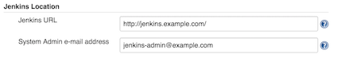
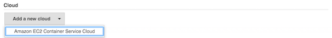
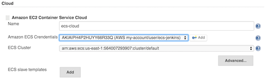
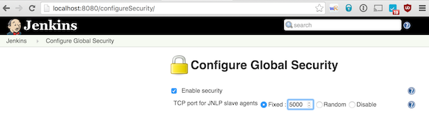
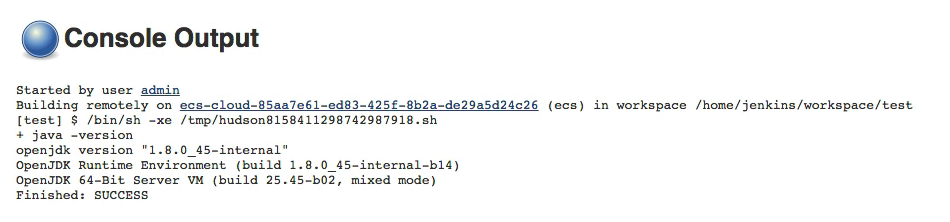

# Jenkins Amazon EC2 Container Service Plugin

# About

[Amazon EC2 Container Service \(ECS)](https://aws.amazon.com/ecs/) is AWS' service for Docker container orchestration to let you deploy Docker based applications on a cluster. 

The [Jenkins Amazon EC2 Container Service plugin](https://wiki.jenkins-ci.org/display/JENKINS/Amazon+EC2+Container+Service+Plugin) let you use Amazon ECS Container service to manage Jenkins cloud slaves. 

Jenkins delegates to Amazon ECS the orchestrations the execution builds on Docker based slaves.
Each Jenkins build is executed on a dedicated Docker container that is wiped-out at the end of the build. 

The ECS cluster is composed of Amazon EC2 virtual machines instantiated within the boundaries the user's account (typically in an Amazon VPC). These virtual machines can be declared statically or can be managed dynamically by AWS ECS thanks to AWS Auto Scaling and AWS CloudFormation. The later 

Jenkins slaves are connected to the Jenkins master using the JNLP protocol.

# Installation

Navigate to the "Plugin Manager" screen, install the "Amazon EC2 Container Service" plugin and restart Jenkins.

   

# Configuration

## Amazon ECS cluster

As a pre-requisite, you must have created an Amazon ECS cluster with associated ECS instances. These instances can be statically associated with the ECS cluster or can be dynamically created with Amazon Auto Scaling.

The Jenkins Amazon EC2 Container Service plugin will use this ECS cluster and will create automatically the required Task Definition.

## Jenkins System Configuration

Navigate to the "Configure System" screen. 

In the "Jenkins Location" section, ensure that the "Jenkins URL" is reachable from the the container instances of the Amazon ECS cluster. See the section "Network and firewalls" for more details.

   

At the bottom of the screen, click on "Add a new Cloud" and select "Amazon EC2 Container Service Cloud".

   

### Amazon EC2 Container Service Cloud

Then enter the configuration details of the Amazon EC2 Container Service Cloud:

* Name: name for your ECS cloud (e.g. `ecs-cloud`)
* Amazon ECS Credentials: Amazon IAM Access Key with privileges to create Task Definitions and Tasks on the desired ECS cluster
* ECS Cluster: desired ECS cluster on which Jenkins will send builds as ECS tasks
* ECS Template: click on "Add" to create the desired ECS template or templates 

**Advanced Configuration**

* Tunnel connection through: tunnelling options (when Jenkins runs behind a load balancer...).

    

### ECS Slave Templates

One or several ECS slave template can be defined for the Amazon EC2 Container Service Cloud. The main reason to create more than one ECS slave template is to use several Docker image to perform build (e.g. java-build-tools, php-build-tools...)

* Label: slave labels used in conjunction with the job level configuration "Restrict where the project can be run / Label expression". ECS slave label could identify the Docker image used for the slave (e.g. `docker` for the [jenkinsci/jnlp-slave](https://hub.docker.com/r/jenkinsci/jnlp-slave/)).
* Docker image: identifier of the Docker image to use to create the slaves
* Filesystem root: working directory used by Jenkins (e.g. `/home/jenkins/`). 
* Memory: number of MiB of memory reserved for the container. If your container attempts to exceed the memory allocated here, the container is killed.
* The number of cpu units to reserve for the container. A container instance has 1,024 cpu units for every CPU core.

**Advanced Configuration**

* Override entrypoint: overwritten Docker image entrypoint. Container command can't be overriden as it is used to pass jenkins slave connection parameters.
* JVM arguments: additional arguments for the JVM, such as `-XX:MaxPermSize` or GC options.

   

## Network and firewalls

Running the Jenkins master and the ECS container instances in the same Amazon VPC and in the same subnet is the simplest setup and default settings will work out-of-the-box.

### Firewalls

If you enable network restrictions between the Jenkins master and the ECS cluster container instances, 

* Fix the TCP listen port for JNLP slaves of the Jenkins master (e.g. `5000`) navigating in the "Manage Jenkins / Configure Global Security" screen
* Allow TCP traffic from the ECS cluster container instances to the Jenkins master on the listen port for JNLP slaves (see above) and the HTTP(S) port.

### Network Address Translation and Reverse Proxies

In case of Network Address Translation rules between the ECS cluster container instances and the Jenkins master, ensure that the JNLP slaves will use the proper hostname to connect to the Jenkins master doing on of the following:

* Define the proper hostname of the Jenkins master defining the system property `hudson.TcpSlaveAgentListener.hostName` in the launch command 
* Use the advance configuration option "Tunnel connection through" in the configuration of the Jenkins Amazon EC2 Container Service Cloud (see above).

# Usage

The ECS slaves can be used for any job and any type of job (Freestyle job, Maven job, Workflow job...), you just have to restrict the execution of the jobs on one of the labels used in the ECS Slave Template configuration. Sample with a label named `docker`:

In the console output of the executed builds, you can verify that the build was performed on the ECS cluster checking the slave name that is composed of the ECS cloud name and of a random identifier. Sample console output of a build executed on a slave managed by an ECS cloud named `ecs-cloud`:

# Docker Images for ECS Slaves

The Jenkins Amazon EC2 Container Service Cloud can use for the slaves all the Docker image designed to act as a Jenkins JNLP slave. Here is a list of compatible Docker images:

* [jenkinsci/jnlp-slave](https://hub.docker.com/r/jenkinsci/jnlp-slave/): Jenkins CI official image to run Docker based JNLP slaves
* [cloudbees/jnlp-slave-with-java-build-tools](https://hub.docker.com/r/cloudbees/jnlp-slave-with-java-build-tools/): a Docker image designed by CloudBees with convenient tools to build java applications (openjdk8, maven, selenium, firefox, aws-cli...)

You can easily extend one of these images to add tools or you can create your own Docker image.

